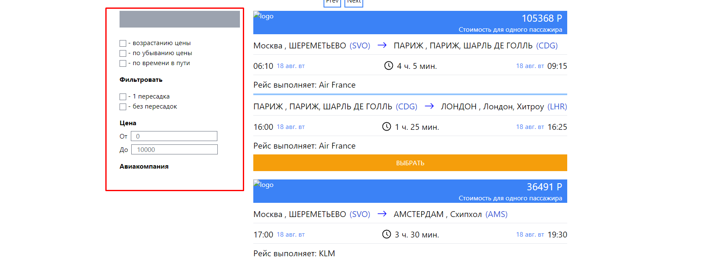

# Тестовое задание компании Gridnine Systems

## Постановка задачи: 
Имеется некая система, которая обрабатывает авиа перелёты. Перелёт — это перевозка пассажира из одной точки в другую с возможными промежуточными посадками. Перелёт можно представить как набор из одного или нескольких элементарных перемещений, называемых сегментами. 
Вам нужно сверстать и отрисовать страницу результатов поиска перелётов. На странице помимо карточек перелётов должен присутствовать блок с фильтрами и сортировками. Фильтрация и сортировка должна происходить без перезагрузки страницы.
К заданию прилагается mock файлом со список перелётов, а так же общий вид макета страницы с перечнем фильтров и блоком сортировки.
Обращаем внимание, что фильтры по пересадкам и авиакомпаниям должны строиться на основании данных mock файла. Дополнительно, по возможности, предусмотрите фасетную фильтрацию с динамическим состоянием фильтров (к примеру при выбранном фильтре «без пересадок» фильтры авиакомпаний, для которых таких перелетов нет, становятся неактивными).
Вы можете использовать любой фреймворк на ваше усмотрение или чистый JS. 
Мы не накладываем ограничений на поддержку браузеров.

### Технологии

В процессе выполнения мною были выбраны такие технологии: json-server для запроса к фейковому mock-файлу, react для основы приложения и сss-фрейморк - tailwind для упрощенного и быстрого написания стилей. Сайтом для деплоя был выбран сам github. 

## Что сделано: 
1. Полностью сделан каркас приложения в виде разметки и стилей, за исключением параметра "пересадка"

3. Поскольку перелетов в mock файле 313 мною было решено добавить постраничную пагинацию с двумя кнопками ее переключания для более удобного просмотра, это был некий челенж потому что раньше я пагинацию не делал.Так же пагинация расположена вверху приложения, думаю в будущем она будет перенесена в другое более удобное место.
   

## Что не сделано:
1. В mock файле мне не удалось найти лого авиакомпаний, поэтому логотипы заменены пустой картинкой. 

2. К сожалению мне не удалось на данный момент разобраться в фильтрации через mock-файл. 

### Сложности при выполнении: 
1. Из описания задания понятно что такое "segments" но не понятно что такое "legs", в итоге мною решено было отрисовать только все сегменты одного "legs". 

2. Была сложность при композиции компонента карточки полета и декомпозиции его на подкомпоненты, встал вопрос о том что в дочерний компонент "FlightCard" приходит около 20 props, я пытался выше в компоненте "ListOfFlights" сделать 2 обьекта с двумя сегментами, и присвоить им поля двух сегментов, но в данном решении мне не удалось проверять поля на их наличие, поэтому пути для пропсов пришлось писать полностью.

3. Так же были написаны 3 кастомные функции в папке "dateFunctions" для обработки приходящих данных из mock файла, так как они были некорректного формата, данные функции мною было решено для оптимизации кода вынести в отдельный файлик и использовать экспортом. В процессе выполнения была замечена ошибка в подсчете времени между отправлением и приземлением, изначально я предположил что я ошибься при написании функций, но при проверке оказалось не так, это данные из mock файла ошибаются на час в каждом рейсе.

### Вывод:

К сожалению пришел к выводу, что потратил отведенное мне компанией время неэффективно, и следовало гораздо лучше его распределить чтобы все успеть сделать, но так как времени и так было дано неделю, считаю наглостью с моей стороны просить времени еще больше. До многих вещей я должен был додуматься раньше и быстрее. В любом случае благодарю компанию Gridnine Systems за отличное тестовое, за возможность прокачать и протестировать свои навыки. Понял что многие аспекты еще нужно подтягивать. Так же данный проект в любом случае будет доработан до конца, будет произведен рефакторинг некоторых вещей так как они кажутся мне вообще не оптимальными. Возможно так же будет интеграция typescript.

### Ссылка на деплой: https://alexandrsyvorotkin.github.io/Fly-test/
